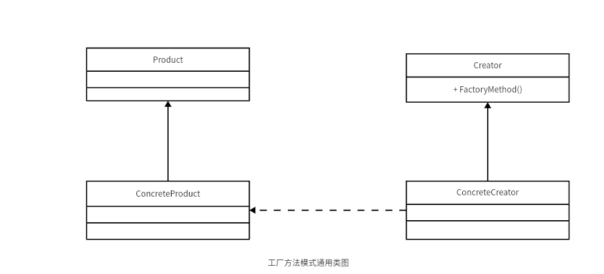
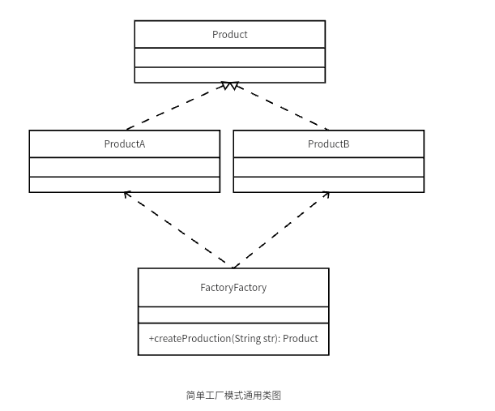

# design-pattern
this project is about 23 design pattern

## 1、单例模式
优点：

    1、内存中只存在一个实例，减少内存开销
    2、避免对资源的多重占用
    3、可以在全局设置访问点，优化和共享资源访问

缺点：

    1、拓展困难
    2、与单一职责原则冲突

使用场景

    1、要求生成唯一序列
    2、需要在项目中设置全局访问点
    3、需要定义大量静态常量和静态方法
  
## 2、工厂方法模式
    




- 工厂方法模式优点

    1、良好的封装性，代码结构清晰

    2、拓展性好

    3、屏蔽产品类


1、抽象产品类
```java
/**
 * 抽象产品
 */
public abstract class Product {
    
    public void production() {
        System.out.println("公共方法");
    }
    // 抽象方法
    public abstract void create();
}

```
2、具体产品类 实现抽象产品抽象方法

```java
/**
 * 具体产品1
 */
public class Production1 extends Product{
    @Override
    public void create() {
        System.out.println("create product 1");
    }
}

/**
 * 具体产品2
 */
public class Production2 extends Product{
    @Override
    public void create() {
        System.out.println("create product 2");
    }
}
```
3、抽象工厂
```java
/**
 * 抽象工厂类
 */
public abstract class Creator {
    
    public abstract <T extends Product> T createProduct(Class<T> clazz);
}

```
4、具体工厂实现
```java
/**
 * 具体工厂
 */
public class ConcreteCreator extends Creator{
    @Override
    public <T extends Product> T createProduct(Class<T> clazz) {
        Product product = null;
        try {
            product = clazz.getDeclaredConstructor().newInstance();
        } catch (Exception e) {
            throw new RuntimeException(e.getMessage());
        }
        return (T) product;
    }
}
```